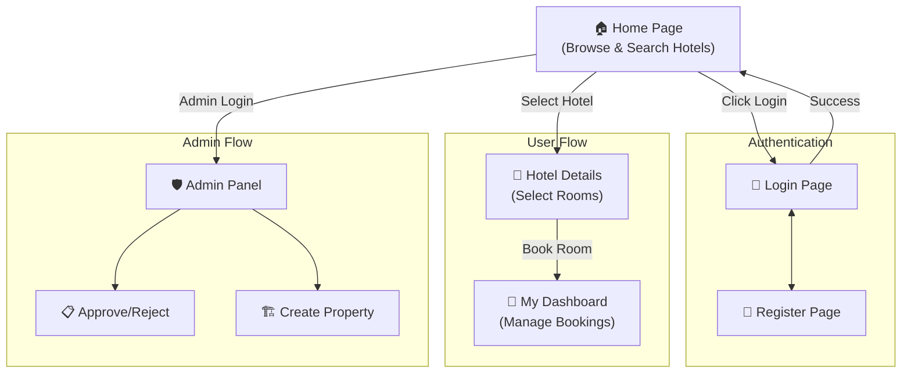
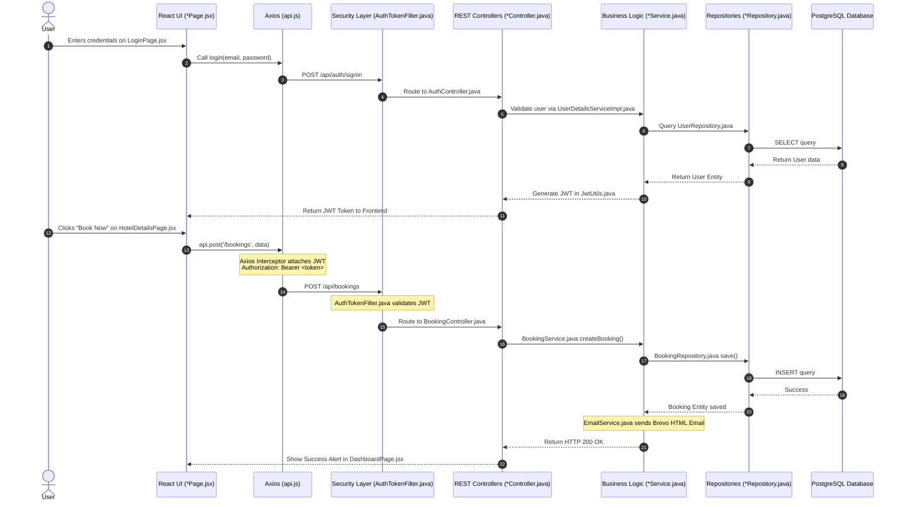
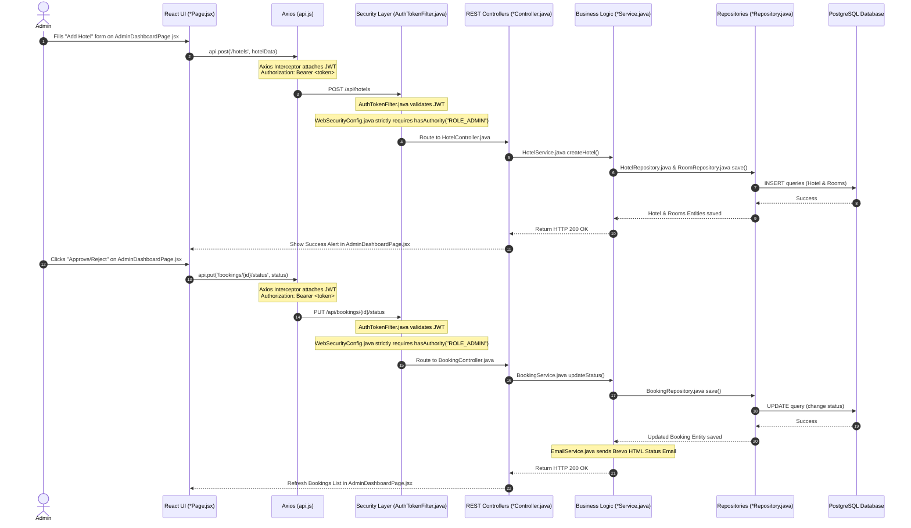
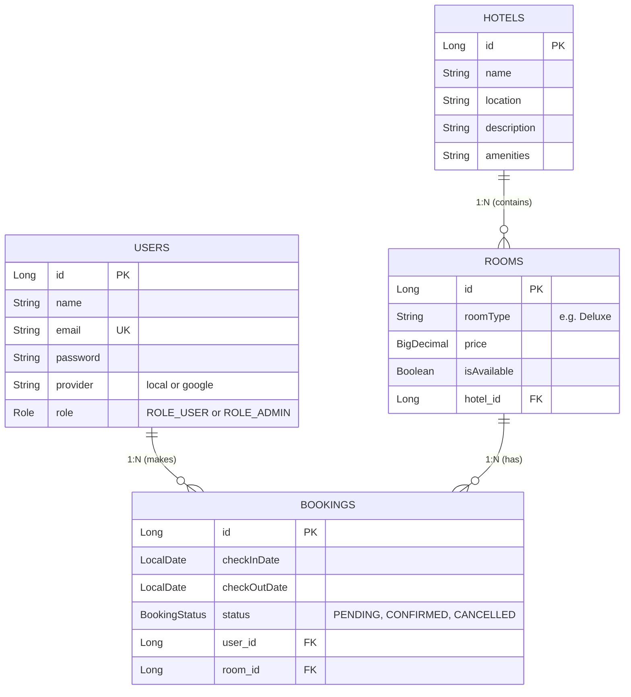

# 🏨 Hotel Booking System - Architecture & Flow Documentation

This document provides a comprehensive overview of the full-stack architecture, including the request lifecycle, API endpoints, database schema, and core class structures.

---

## 1. High-Level Website Navigation Flow
This is a simple, non-technical flowchart showing how a user navigates through the website's pages.

---

## 2. Technical API Request Lifecycle

### 🟢 Standard User Flow (Login & Booking)
This diagram illustrates how a normal user authenticates and books a hotel room.

### 🔴 Admin Flow (Hotel & Room Creation)
This diagram illustrates how an Administrator uses the secured dashboard to create new properties.

---

## 3. Database Schema (Entity Relationship Diagram)

---

## 4. Backend Class & Interface Definitions

### 🏛️ Core Models (Entities)
- `User.java`: Represents the user profile and credentials.
- `Hotel.java`: Represents a physical hotel property.
- `Room.java`: Represents a specific room category inside a hotel.
- `Booking.java`: The transactional record linking a User, a Room, and Dates.
- `BookingStatus.java`: Enum (`PENDING`, `CONFIRMED`, `CANCELLED`).

### 📦 DTOs (Data Transfer Objects)
- `LoginRequest.java` / `SignupRequest.java`: Payloads from frontend Auth forms.
- `JwtResponse.java`: The token payload sent back to the frontend.
- `BookingRequest.java`: Contains `roomId`, `checkInDate`, `checkOutDate`.
- `HotelRequest.java`: Contains `name`, `location`, `description`, `amenities`, and `List<RoomRequest>`.
- `RoomRequest.java`: Contains `roomType`, `price`.

### 🗄️ Repositories (Interfaces extending JpaRepository)
- `UserRepository.java`: Queries users by email.
- `HotelRepository.java`: Queries hotels by location.
- `RoomRepository.java`: Finds available rooms for specific date ranges using custom `@Query`.
- `BookingRepository.java`: Queries bookings by `UserId` (for dashboard) or gets all (for admin).

### ⚙️ Services (Business Logic)
- `HotelService.java`: Logic for searching hotels and dynamically creating new ones.
- `BookingService.java`: Logic for checking room availability, creating a booking, and verifying ownership before cancellation.
- `EmailService.java`: Communicates with the Brevo HTTP API to send HTML notifications.
- `UserDetailsServiceImpl.java`: Implements Spring Security's `UserDetailsService` to load users from the DB during login.

### 🔌 Controllers (REST Endpoints)
- `AuthController.java`: Exposes `/api/auth/signin` and `/api/auth/signup`.
- `HotelController.java`: Exposes `/api/hotels` (Public GET, Admin POST).
- `BookingController.java`: Exposes `/api/bookings` (User standard flow) and `/api/bookings/admin` (Admin approval flow).

### 🛡️ Security
- `WebSecurityConfig.java`: The master configuration. Enables CORS, disables CSRF (since we use JWT), and secures endpoints based on user roles (`ROLE_USER`, `ROLE_ADMIN`).
- `AuthTokenFilter.java`: Intercepts HTTP requests, validates the `Authorization` header, and sets the Security Context.
- `JwtUtils.java`: Helper class to generate and parse JSON Web Tokens.
